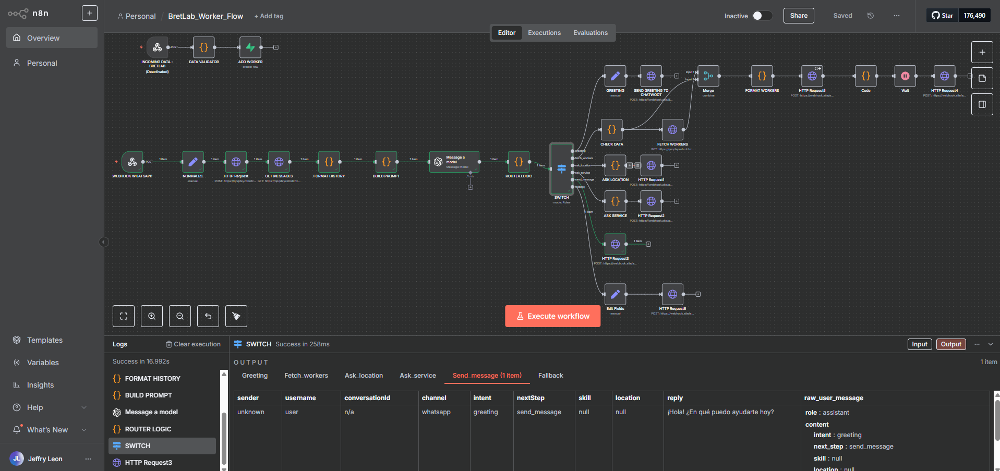
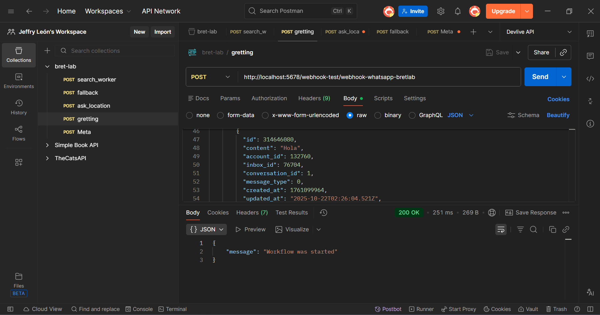
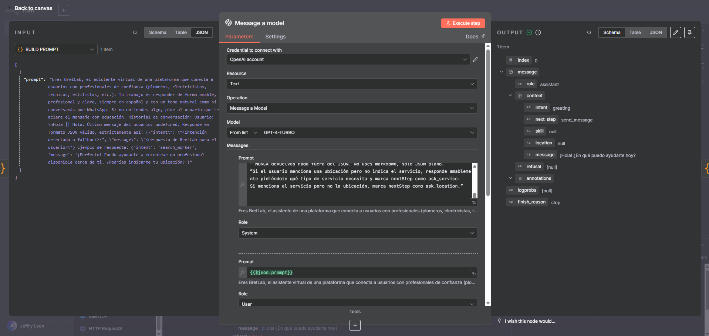
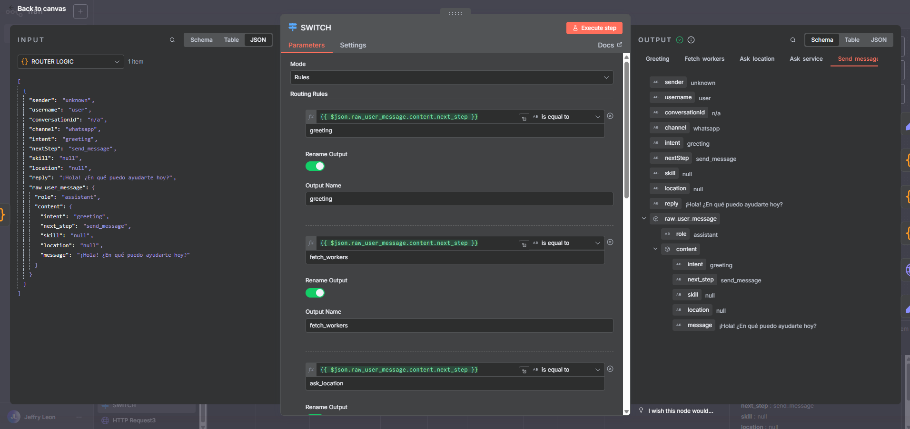
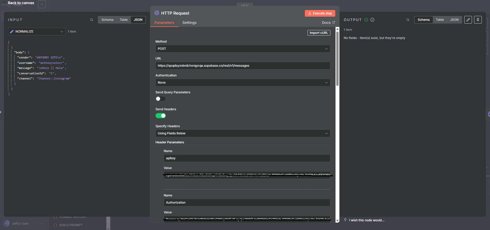
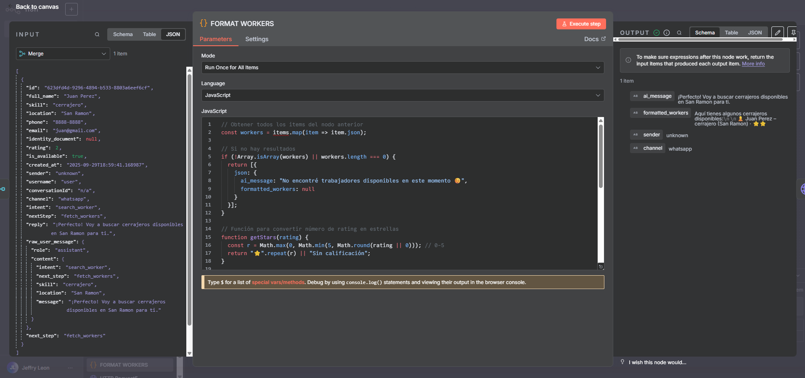
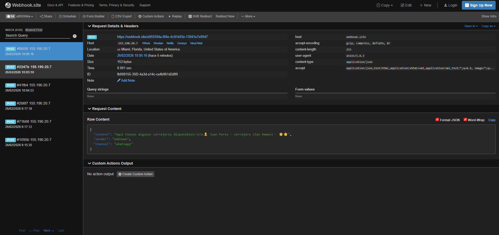

# BretLab AI Workflow Demo

AI workflow orchestrator built with n8n, OpenAI (GPT-4) and Supabase.

This project demonstrates an event-driven architecture capable of receiving user messages via webhook, processing them through a structured LLM pipeline, routing logic dynamically based on detected intent, querying a database, and generating formatted responses.

---

## Overview

The system is designed to:

- Receive incoming messages through a webhook
- Normalize and persist conversation history in Supabase
- Build contextual prompts dynamically
- Generate structured JSON output using GPT-4
- Route execution based on detected intent
- Fetch relevant workers from the database
- Format and return a final response via webhook

This repository focuses on workflow orchestration and system design rather than frontend implementation.

---

## Architecture

Webhook  
→ Normalize Input  
→ Persist Message (Supabase)  
→ Fetch Conversation History  
→ Build Prompt  
→ GPT-4 (Structured JSON Output)  
→ Router Logic  
→ Intent-Based Switch  
→ Fetch Workers (Supabase)  
→ Format Response  
→ Send Webhook Response  

---

## Key Features

- Structured LLM output with strict JSON schema
- Intent detection and next-step routing
- Database persistence using Supabase
- Dynamic worker filtering by skill and location
- Event-driven orchestration using n8n
- Separation of responsibilities within the workflow

---

## Screenshots

### Workflow Overview


### Webhook Trigger (Postman)


### GPT Node Configuration


### Structured LLM Output


### Routing and Switch Logic


### Supabase Message Persistence


### Supabase Worker Fetch


### Formatted Worker Response


### Final Webhook Response


---

## Example Test Payload

```json
{
  "body": {
    "sender": "demo_user",
    "username": "demo_user",
    "message": "Necesito un cerrajero en San Ramón",
    "conversationId": "1",
    "channel": "Channel::WhatsApp"
  }
}
```

---

## Environment Variables

See `.env.example` for required configuration values.

---

## Security Notes

- API keys and tokens have been removed.
- Workflow JSON has been sanitized.
- This repository is for demonstration purposes only.

---

## Technologies

- n8n
- OpenAI (GPT-4)
- Supabase
- Postman
- Webhook.site

---

## Author

Jeffry León  
Full Stack Developer | Linux & Workflow Automation